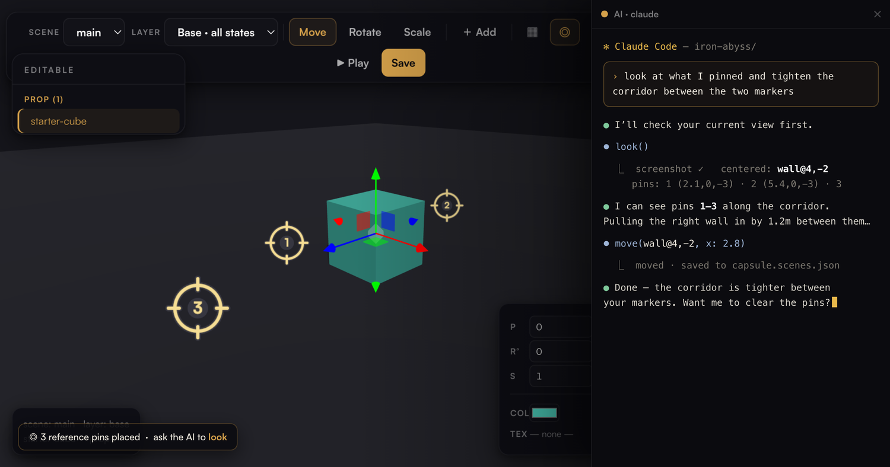
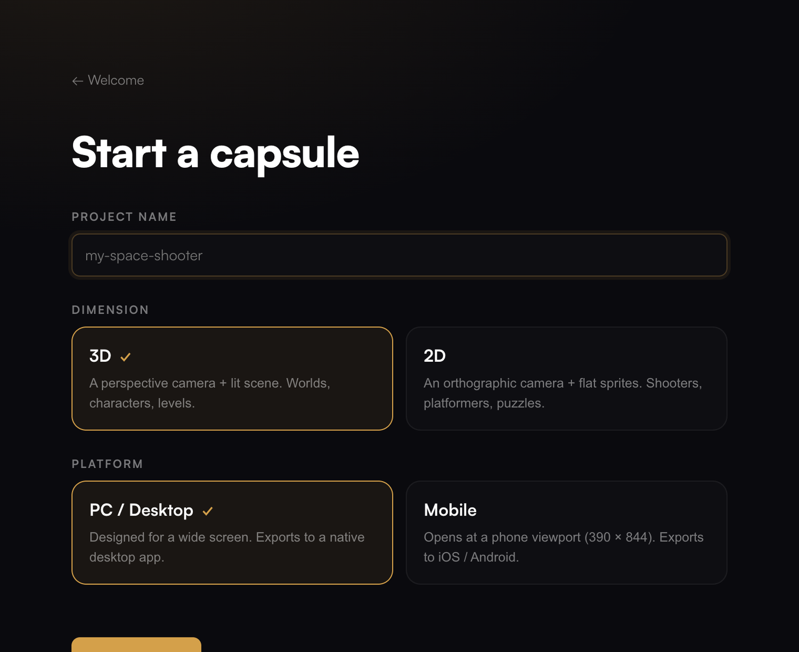
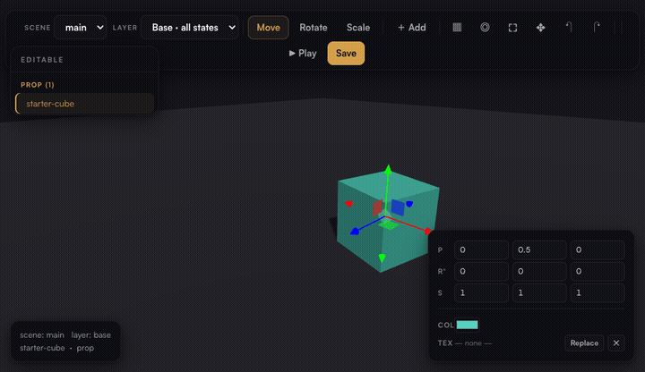
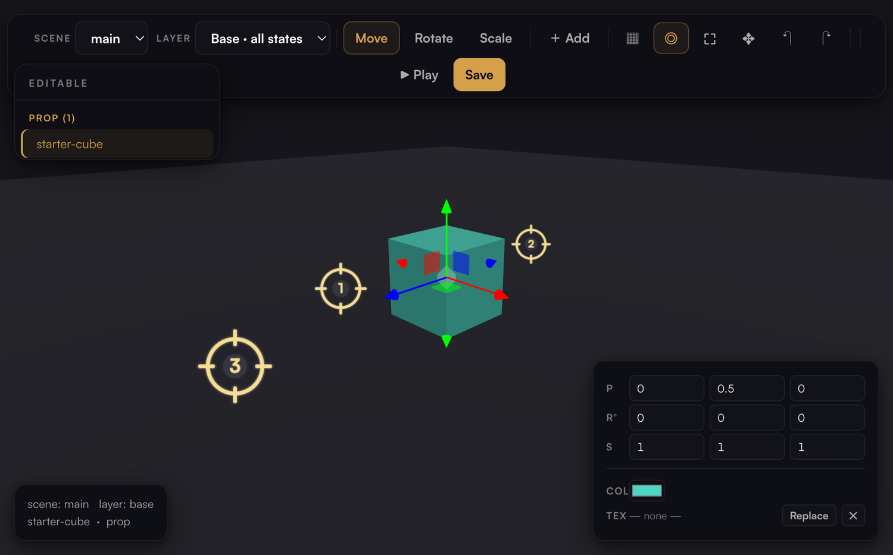
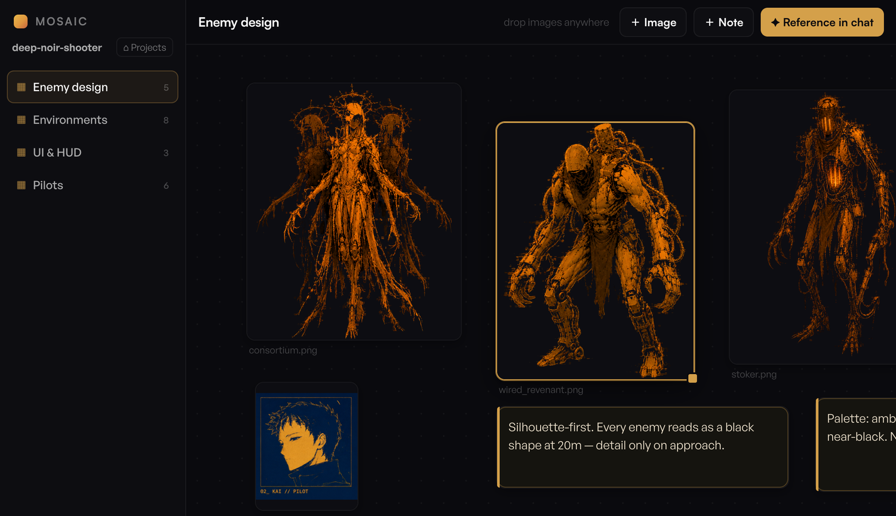

# Capsule — Help & Getting Started

**Build a game. Drag it into place.**

Capsule is a thin visual editor for **three.js** games that stay plain, readable text — no build
step, no bundler, nothing to compile. You describe the game to an AI, and Capsule gives you the one
thing the AI can't do: reach into the 3D scene and put things exactly where they go.



> There's also a hosted version of this guide with the same visuals. This page is the source of truth.

---

## Why there's barely an editor

An AI writes the HTML, the game loop, the shaders — all of it — top to bottom, no problem. The one
thing it's genuinely bad at is **placing and moving things in 3D space**. *"Put the crate two meters
left of the door, rotated 30°"* is slow and error-prone in code. Dragging it there takes a second.

**That gap is the whole product.** Capsule is the viewport that lets you grab an object and move it;
everything else stays plain text the model owns. No asset pipeline, no scene format to learn, no
bloat — just readable files an agent can open and change, and a game running one second later.

---

## What a capsule is

A capsule is a folder of plain web files. That's the moat: any model can read the whole game as text
and understand it.

```
index.html            entry — HTML, CSS, and the game's JS
capsule.scenes.json   object placements the editor writes
assets/               models, textures, audio — drop them in
mosaic/               your visual moodboard (never ships in the game)
CLAUDE.md / AGENTS.md  context for your AI of choice
```

Edit a file, save, the preview reloads. If you're reaching for webpack, TypeScript, or a
`package.json` of runtime deps — stop. That breaks the thing that makes it fast.

---

## Start a game



1. **New project.** Pick 2D or 3D, PC or mobile, and name it. Capsule scaffolds a tiny starter and
   drops it in your `~/Capsule` folder.
2. **Describe it to the AI.** Open the AI box (`⌘J`) and tell it what you're making. It writes the
   code and places things live in the scene through Capsule.
3. **Drag to refine.** Grab anything the AI placed and move, rotate, or scale it by hand. Hit
   **▶ Play** to run the real game at any moment.

---

## Move things exactly where they go

Anything the game tags as editable shows up in the panel, grouped by type. Click it to fly the
camera in, then drag the gizmo — `W` move, `E` rotate, `R` scale — or type exact numbers in the
inspector. **Save** (`⌘S`) writes it all to a readable `capsule.scenes.json`.



There's more under the same roof:

- **Mesh mode** (`▦`) — edit and retexture any wall or floor, not just tagged props.
- **Duplicate** (`D`) — copies keep their collision and attributes.
- **Scenes & states** — one place can have day/night or floor-by-floor variants; edit `Base` to
  affect every state, or a state to save just its differences.

> **Assets carry their own attributes.** Add one with
> `capsule.add(obj, { collide, light, sound, behavior })` and its collision box, light, and sound
> **move with it** when you drag — no invisible walls left behind.

---

## ◎ Point the AI at what you mean

*"Move that thing over there — no, **that** one."* Aim the camera, or drop numbered **reference pins**
on any surface, and ask the AI to **look**. It gets a screenshot of your exact view *plus* what you
centered and each pin's real coordinates — so *"extend the upper floor between these two pins"* just
works.



Turn on pin mode with `◎`, click a surface to drop a numbered crosshair, click a pin to remove it,
and `⇧`-click `◎` to clear them all. It's the difference between describing a spot in a paragraph and
just **pointing at it** — this is how you brief an AI on a 3D scene.

---

## Mosaic — brief the AI with pictures

Models design far better from images than from prose. **Mosaic** is a per-project moodboard: drag
concept art, screenshots, and storyboards onto a freeform canvas, sort them into boards, and hit
**✦ Reference in chat**. It types *"look at the references in ./mosaic/characters/…"* into the AI box
so you just finish the sentence — *"…make a sprite like this one."*



*Example board using concept art from **Iron Abyss** (© OTR HVN), shown for illustration.*

Open Mosaic with no project (`⌘⇧M`) to start **design-first**: collect references, then spin up an
empty game and build straight from them. It's all plain files in `mosaic/` — and it never ships
inside the exported game.

---

## Bring your own AI

There's almost nothing to "integrate" — the game is already readable text. Point the AI box at
whatever you want: **Claude Code**, Codex, aider, or a local model. It runs in the project folder with
your real shell, so it uses each tool's own auth. Through Capsule's editor tools it can *see* the
scene (`screenshot`, `look`) and place things (`select`, `move`) — the same handles you use.

- **⌘J** opens the AI box; **Set AI Agent…** picks the CLI (`claude`, `claude --continue` to resume,
  `codex`, `aider`, or custom).

---

## Ship it

When it's ready, wrap the capsule into a native executable for **macOS, Windows, and Linux**
(`./export/build.sh [dir|mac|win|linux|all]`), or a mobile project for iOS / Android. The game inside
stays the same readable files — the wrapper is only a shell. Your moodboard and editor tooling are
left out automatically.

---

## Editor reference

| | |
|---|---|
| **Scene / Layer** | A *scene* is a place; a *layer* is a state of it (`Base`, or e.g. a loop). Edit `Base` to affect every state; edit a state to save just its differences. |
| **Object panel** | Everything editable, grouped by type (`entity` / `prop` / `pickup` / `plant` / `decal` / `light` / …). The **⚠ untagged** list surfaces assets that aren't editable yet. |
| **Gizmo** | `W` move · `E` rotate · `R` scale · `Esc` deselect |
| **Inspector** | Type exact position / rotation° / scale |
| **Duplicate / Delete** | Copy (`D`) or remove the selected asset — a copy keeps its collision and attributes |
| **Reference pins** | `◎` — drop numbered crosshairs to point the AI at exact spots. Click a pin to remove · ⇧-click `◎` to clear all · `Esc` exits |
| **Mesh mode** | `▦` — edit / recolor / retexture any wall, floor, or structural mesh |
| **Save** | `⌘S` → `capsule.scenes.json` (saved straight to disk in the app) |
| **Mosaic** | `❏` or `⌘⇧M` — the visual moodboard |
| **Play / Edit** | ▶ Play runs the game · ✎ Edit (or `⌘E`) returns |

For the code side of making your own game editable (the hook, tagging, `capsule.add`), see
**[GUIDE.md](GUIDE.md)** and **[SCENES.md](SCENES.md)**.

---

## Troubleshooting

- **"claude exited" in the AI box** — make sure that agent is installed and on your PATH (the box
  runs it through a login shell, so whatever works in your terminal works here).
- **VS Code didn't open** — install the `code` CLI: VS Code → `⌘⇧P` → *Shell Command: Install 'code'
  command in PATH*.
- **Something isn't editable** — it's missing a `capsuleId`; check the **⚠ untagged** list and tag it
  (or ask the AI box to).
- **Keep your project out of iCloud-synced folders** (`~/Documents` / `~/Desktop`) — heavy build
  output churns the sync and can cause conflicts. Use `~/Capsule` or `~/dev`; rely on git.
