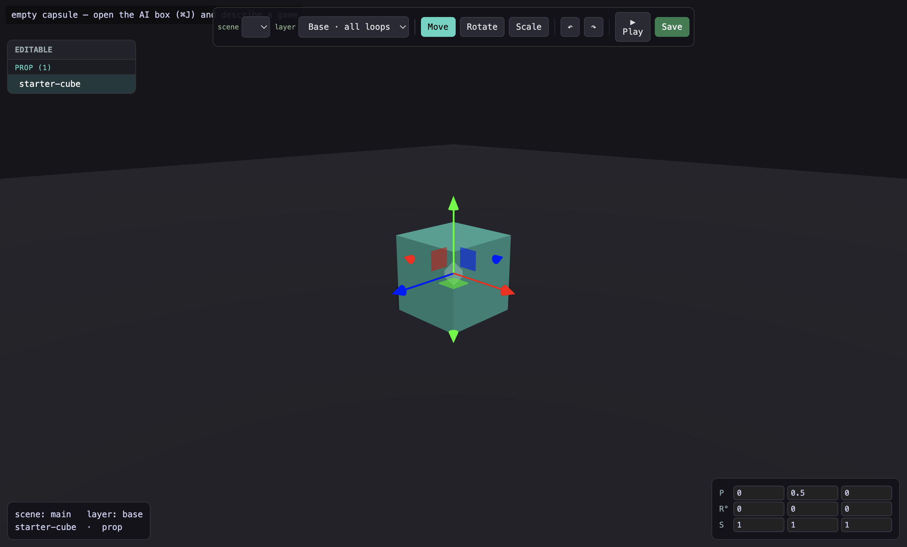
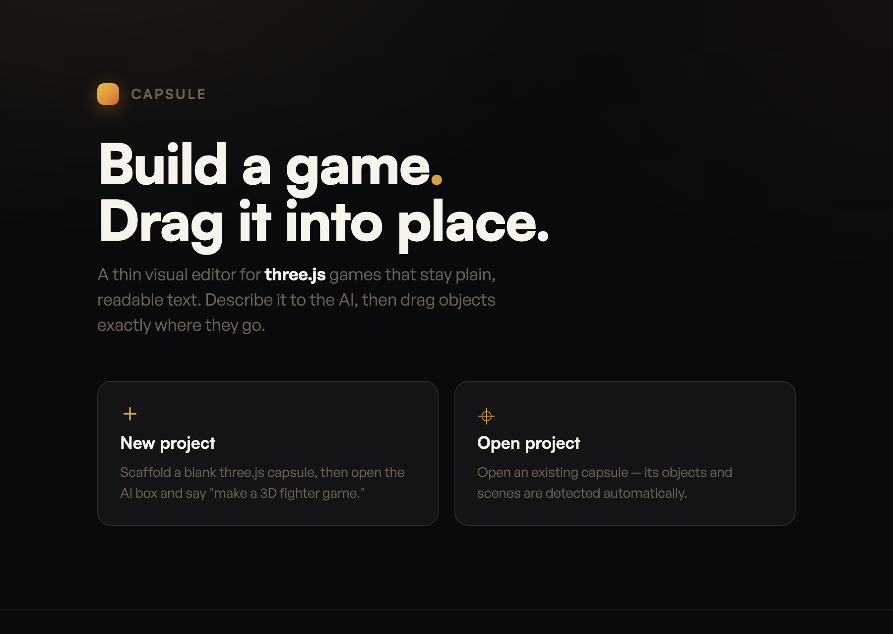
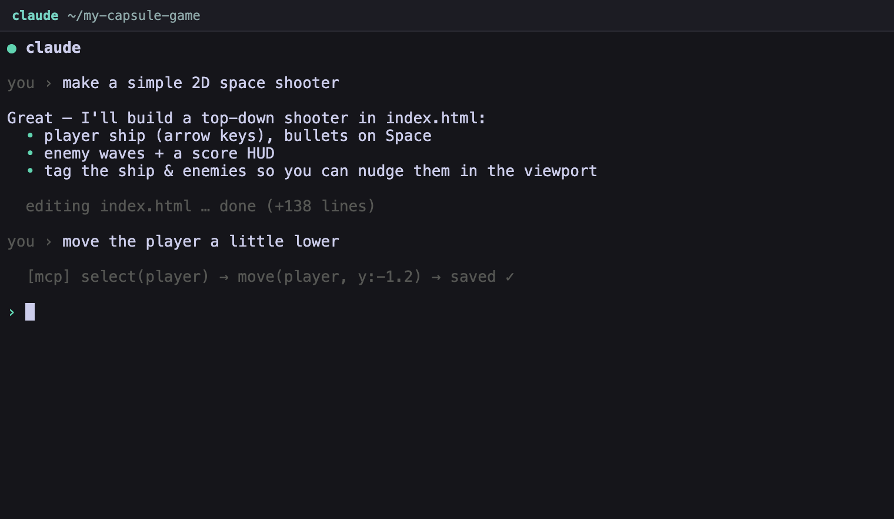
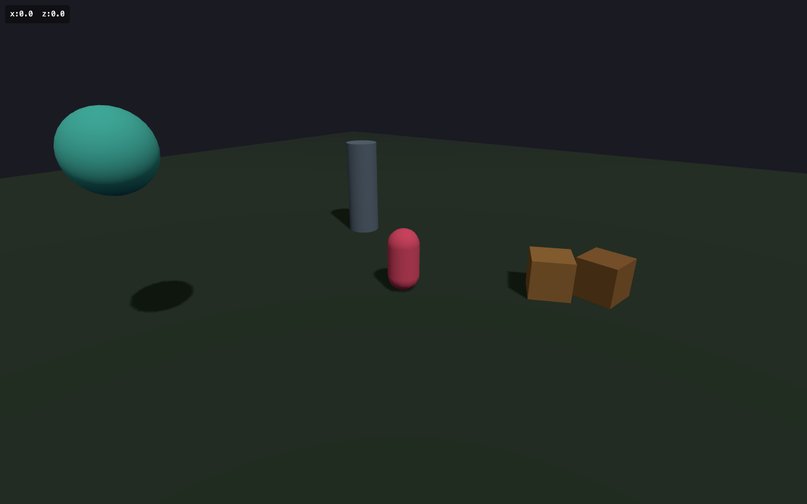

# Capsule — help & demo

Capsule is a thin visual editor for **three.js games that stay plain, readable text** (HTML +
CSS + JavaScript, no build step). You describe the game to an AI, drag objects where they go,
play it, and export to desktop or mobile — all in one app.



*The editor: drag the gizmo to move/rotate/scale, pick a Scene/Layer, undo/redo, the object
panel groups everything by type, the inspector shows exact numbers, and ▶ Play runs the game.*

---

## Install & run

**From source (any platform):**
```bash
cd app
npm install
npx @electron/rebuild -w node-pty   # first time: build the terminal module for Electron
npm start
```

**Or the packaged app (macOS):** open `app/dist/Capsule-<version>.dmg`, drag to Applications,
run. It's unsigned, so the first launch: **right-click the app → Open**.

---

## Make a simple game (the 60-second tour)

### 1. New project



On launch you get the welcome screen. **+ New project** scaffolds a blank-but-working capsule
(a minimal three.js scene + the editor/AI hook already wired) and opens it. **Open project**
loads an existing capsule and auto-detects its objects.

### 2. Describe the game to the AI



Press **⌘J** to open the **AI box** — a terminal running your agent of choice (`claude` by
default; `codex`, `aider`, or any CLI via *Set AI Agent…*). It runs **in your project** and is
wired to the editor, so it can both write code *and* place objects:

> *"make a simple 2D space shooter"* … *"move the player a little lower"*

The agent edits the game files and can `select` / `move` objects in the live viewport (via
Capsule's MCP server). A non-coder can stay entirely in this loop and never open a file.

### 3. Drag to refine


When you want precision, grab it yourself. Click an object → drag the **gizmo**:

- **W** move · **E** rotate · **R** scale
- Type exact values in the **inspector** (bottom-right)
- **⌘Z / ⌘⇧Z** undo / redo
- The **object panel** lists everything editable, grouped by type, with a **⚠ untagged** section
  for assets that still need a tag

**Save** writes placements to `capsule.scenes.json` — plain readable data, never a binary blob.

### 4. Play it



Hit **▶ Play** to run the real game (your saved placements apply). A **✎ Edit** button appears
top-right to jump back to the editor (or **⌘E**).

### 5. Add your own assets

**Drag a `.glb` / `.gltf` onto the editor** — it's saved into `assets/models/`, dropped into the
scene, sized, grounded, and made editable. (Or just ask the AI box to add one.)

### 6. Export

- **Desktop:** `./export/build.sh mac` (or `win` / `linux`) → a native app. three.js is vendored
  locally so it runs fully offline.
- **Mobile:** `./mobile-export/build.sh ios|android` → a Capacitor project you open in Xcode /
  Android Studio. (Games also just *play* in any mobile browser.)
- Use the **Viewport** menu (Desktop / Phone / Tablet) to design for the target screen.

---

## Editor reference

| | |
|---|---|
| **Scene / Layer** | A *scene* is a place; a *layer* is a state of it (e.g. `Base`, or a loop). Edit `Base` to affect every state; edit a state to save just its differences. |
| **Object panel** | Everything editable, grouped by type (`entity`/`prop`/`pickup`/`plant`/`decal`/…). The **⚠ untagged** list surfaces assets that aren't editable yet. |
| **Gizmo** | `W` move · `E` rotate · `R` scale · `Esc` deselect |
| **Inspector** | Type exact position / rotation° / scale |
| **Save** | `⌘S` → `capsule.scenes.json` (saved straight to disk in the app) |
| **Play / Edit** | ▶ Play runs the game · ✎ Edit (or ⌘E) returns |

## The AI box

- **⌘J** opens it; **Set AI Agent…** picks the CLI (`claude`, `claude --continue` to resume your
  last conversation, `codex`, `aider`, or custom).
- It runs in the project dir with your real shell environment, so it uses each tool's own auth.
- It reaches the editor through Capsule's **MCP server** (`list_editables`, `select`, `move`,
  `screenshot`, …), so the agent can *see* the scene and place things.

## Making your game editable (for the code-curious)

An object becomes editable just by carrying a `userData.capsuleId`. The scaffold tags a starter
cube for you; to make more things editable, tag them:

```js
capsule.tag(obj, { type: 'prop' });          // auto-ids from position
capsule.registerEditable(boss, 'boss', 'entity');
```

Full conventions are in [GUIDE.md](GUIDE.md) and [SCENES.md](SCENES.md).

## Troubleshooting

- **"claude exited" in the AI box** — make sure that agent is installed and on your PATH (the box
  runs it through a login shell, so whatever works in your terminal works here).
- **VS Code didn't open** — install the `code` CLI: VS Code → `⌘⇧P` → *Shell Command: Install
  'code' command in PATH*.
- **Something isn't editable** — it's missing a `capsuleId`; check the **⚠ untagged** list and tag
  it (or ask the AI box to).
- **Keep your project out of iCloud-synced folders** (`~/Documents`/`~/Desktop`) — heavy build
  output churns the sync and can cause conflicts. Use `~/dev` or similar; rely on git.
